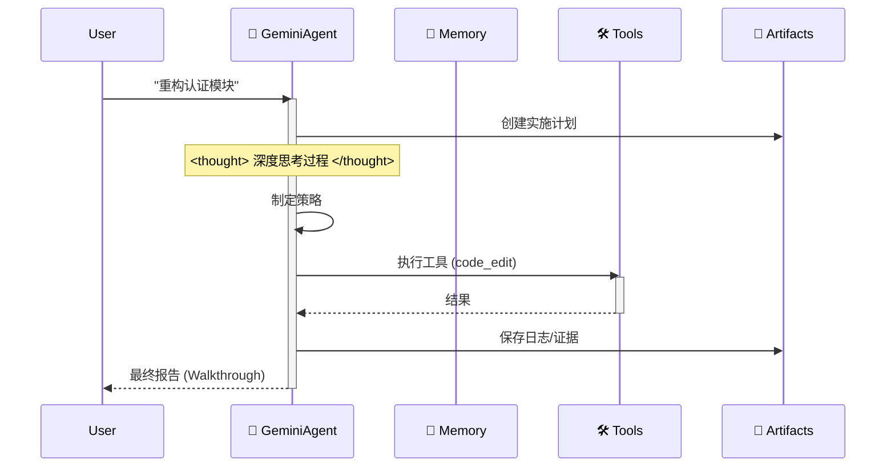

# 🪐 Google Antigravity 工作区模板（企业版）


欢迎使用 **Antigravity 工作区模板**。这是一个生产级的入门套件，用于在 Google Antigravity 平台上构建自主 Agent，完全符合 **Antigravity 官方文档**——并以极简、透明的架构自豪地成为 “Anti-LangChain”。


## 🌟 项目初衷

在当前 AI IDE 这么丰富的现在，我只需要 **Clone -> Rename -> Prompt** 这个步骤，就可以完成一个企业级的架构。

本项目利用了 IDE 的上下文感知能力（通过 `.cursorrules` 和 `.antigravity/rules.md`），将一套完整的 **认知架构** 预埋到了项目文件里。

当你打开这个项目时，你的 IDE 就不再只是一个编辑器，它变成了一个**“懂行”的架构师**。

### 为什么我们需要一个“有思想”的脚手架？

在使用 Google Antigravity 或 Cursor 进行 AI 开发时，我发现了一个痛点：

**IDE 和模型都很强，但“空项目”太弱了。**

每次新建一个项目，我们都要重复一遍无聊的配置：
- “我的代码要放在 src 还是 app？”
- “工具函数怎么定义才能让 Gemini 识别？”
- “怎么让 AI 记住上文？”

这种重复劳动是对创造力的浪费。我心中的完美工作流应该是这样的： **Git Clone 下来，IDE 就已经知道该干什么了。**

所以我做了这个项目：**Antigravity Workspace Template**。

## 🧠 核心理念：Artifact-First（产物优先）

本工作区强制执行 **Artifact-First** 协议。Agent 不仅写代码；它会为每个复杂任务产出可验证的 Artifact。

1. **规划**：在编码前先创建 `artifacts/plan_[task_id].md`。
2. **证据**：日志与测试输出保存到 `artifacts/logs/`。
3. **视觉**：UI 变更会生成截图产物。

## 🛸 工作原理

Agent 遵循严格的 “Think-Act-Reflect” 循环，模拟 Gemini 3 的认知过程。



## 🔥 杀手级特性

- 🧠 **无限记忆引擎**：递归式摘要自动压缩历史，打破上下文限制。
- 🛠️ **通用工具协议**：通用 ReAct 模式。把任意 Python 函数注册到 `available_tools`，Agent 即可学会调用。
- ⚡️ **Gemini 原生**：针对 Gemini 2.0 Flash 的速度与函数调用能力做了优化。

## 🚀 快速开始

### 本地开发
1. **安装依赖**：
    ```bash
    pip install -r requirements.txt
    ```
2. **运行 Agent**：
    ```bash
    python src/agent.py
    ```

### Docker 部署
1. **构建并运行**：
    ```bash
    docker-compose up --build
    ```

## 📂 项目结构

```
.
├── .antigravity/       # 🛸 官方 Antigravity 配置
│  └── rules.md        # Agent 规则与权限
├── artifacts/          # 📂 Agent 产物（计划、日志、视觉）
├── .context/           # AI 知识库
├── .github/            # CI/CD 工作流
├── src/                # 源代码
│  ├── agent.py        # Agent 主逻辑
│  ├── config.py       # 设置管理
│  ├── memory.py       # JSON 记忆管理
│  └── tools/          # Agent 工具
├── tests/              # 测试套件
├── .cursorrules        # 兼容性指针
├── Dockerfile          # 生产环境构建
├── docker-compose.yml  # 本地开发配置
└── mission.md          # Agent 目标
```

## 🚀 “零配置” 工作流

停止撰写冗长的系统提示。本工作区已预加载 AI 的认知架构。

### 第一步：克隆与重命名（“模具”）
将此仓库视为工厂模具。克隆后将文件夹重命名为你的项目名称。
```bash
git clone https://github.com/study8677/antigravity-workspace-template.git my-agent-project
cd my-agent-project
# 现在你已准备就绪，无需额外设置。
```

### 第二步：魔法时刻 ⚡️
在 Cursor 或 Google Antigravity 中打开文件夹。
- 👀 **观察**：IDE 自动检测 `.cursorrules`。
- 🧠 **加载**：AI 静默摄取 `.antigravity/rules.md` 中的 “Antigravity Expert” 人格。

### 第三步：直接提示（无需额外指令）
你无需提醒 AI “注意” 或 “使用 src 目录”。它已被预设为高级工程师。

**旧方式（手动提示）**：
> “写一个贪吃蛇游戏，确保模块化，放在 src 里，别忘了注释……”

**Antigravity 方式**：
> “构建一个贪吃蛇游戏。”

AI 会自动：
1. 🛑 **暂停**：“根据协议，我必须先规划。”
2. 📄 **文档**：生成 `artifacts/plan_snake.md`。
3. 🔨 **构建**：将模块化代码写入 `src/game/`，附完整 Google 风格文档字符串。

## 🗺️ 路线图

- [x] **阶段 1：基础**（脚手架、配置、记忆）
- [x] **阶段 2：DevOps**（Docker、CI/CD）
- [x] **阶段 3：Antigravity 合规**（规则、产物）
- [x] **阶段 4：高级记忆**（摘要缓冲区已实现 ✅）
- [x] **阶段 5：认知架构**（通用工具调度已实现 ✅）
- [x] **阶段 6：动态发现**（自动工具与上下文加载 ✅）
- [x] **阶段 7：多智能体 Swarm**（路由器-工作者编排 ✅）
- [ ] **阶段 8：企业级核心** ("Agent OS" 愿景) - *由 [@devalexanderdaza](https://github.com/devalexanderdaza) 提议*
  - [ ] **MCP 集成**：导入/暴露模型上下文协议服务器，实现通用工具连接。
  - [ ] **沙箱环境**：安全代码执行（如 E2B 或本地 Docker），用于高风险操作。
  - [ ] **编排工作流**：用于复杂任务的结构化、并行执行管道 (DAG)。

## 👥 贡献者

特别感谢参与本项目建设的社区成员：

- [@devalexanderdaza](https://github.com/devalexanderdaza) 💻 🧠 **(首位贡献者!)**
  - 实现了演示工具脚本，并增强了 Agent 的功能集成。
  - 提出了 **"Agent OS" 路线图** (MCP, 沙箱, 编排)。
- [@Subham-KRLX](https://github.com/Subham-KRLX) 💻
  - 添加动态工具和上下文加载 (修复 #4)
  - 新增功能：添加多智能体集群协议 (修复 #6)

**想要参与贡献？** 请查看我们的 [Issues](https://github.com/study8677/antigravity-workspace-template/issues) 页面！

## 💡 征集创意：Swarm 协议

我们像重视代码一样重视**创意 (Ideas)**！
我们目前正在为 **第六阶段：多智能体 Swarm** 进行架构头脑风暴。如果您能提供可靠的架构建议或详细设计并被采纳，**您将被列入我们的 README 贡献者名单**。

即使您没有时间编写实现代码，也请随时在 [Issues](https://github.com/study8677/antigravity-workspace-template/issues) 中分享您的想法。