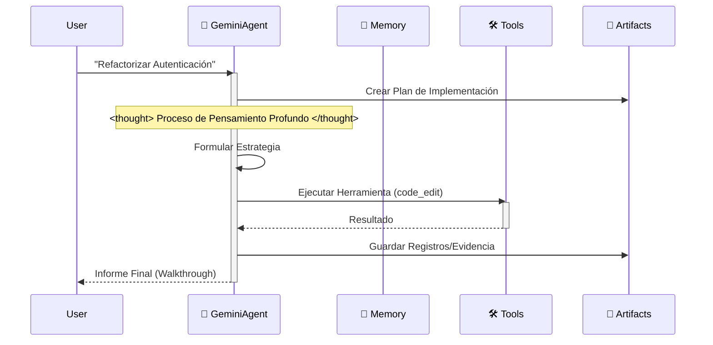

# 🪐 Plantilla de Espacio de Trabajo Google Antigravity (Edición Empresarial)


Bienvenido a la **Plantilla de Espacio de Trabajo Antigravity**. Es un kit de inicio de nivel producción para construir agentes autónomos en la plataforma Google Antigravity, totalmente alineado con la **Documentación Oficial de Antigravity** y orgullosamente “Anti-LangChain” por su arquitectura mínima y transparente.


## 🌟 Filosofía del Proyecto

En una era rica en IDEs de IA, quería lograr una arquitectura de nivel empresarial con solo **Clonar -> Renombrar -> Prompt**.

Este proyecto aprovecha la conciencia del contexto del IDE (a través de `.cursorrules` y `.antigravity/rules.md`) para incrustar una **Arquitectura Cognitiva** completa directamente en los archivos del proyecto.

Cuando abres este proyecto, tu IDE ya no es solo un editor; se transforma en un **Arquitecto "Conocedor"**.

### ¿Por qué necesitamos un Andamiaje "Pensante"?

Al usar Google Antigravity o Cursor para el desarrollo de IA, encontré un punto débil:

**Los IDEs y los modelos son poderosos, pero los "proyectos vacíos" son débiles.**

Cada vez que iniciamos un nuevo proyecto, repetimos configuraciones aburridas:
- "¿Debería ir mi código en src o app?"
- "¿Cómo defino las funciones de herramientas para que Gemini las reconozca?"
- "¿Cómo hago que la IA recuerde el contexto?"

Este trabajo repetitivo es un desperdicio de creatividad. Mi flujo de trabajo ideal es: **Git Clone -> El IDE ya sabe qué hacer.**

Por eso creé este proyecto: **Antigravity Workspace Template**.

## 🧠 Filosofía Central: Artifact-First (Artefacto-Primero)

Este espacio de trabajo impone el protocolo **Artifact-First**. El Agente no solo escribe código; produce artefactos tangibles para cada tarea compleja.

1. **Planificación**: Se crea `artifacts/plan_[task_id].md` antes de codificar.
2. **Evidencia**: Los registros y salidas se guardan en `artifacts/logs/`.
3. **Visuales**: Los cambios de UI generan capturas como artefactos.

## 🛸 Cómo Funciona

El agente sigue un bucle estricto de “Pensar-Actuar-Reflexionar”, simulando el proceso cognitivo de Gemini 3.



## 🔥 Funciones Asesinas

- 🧠 **Motor de Memoria Infinita**: La resumición recursiva comprime el historial automáticamente; los límites de contexto dejan de ser un problema.
- 🛠️ **Protocolo Universal de Herramientas**: Patrón ReAct genérico. Registra cualquier función de Python en `available_tools` y el Agente sabrá usarla.
- ⚡️ **Nativo de Gemini**: Optimizado para la velocidad y las llamadas a funciones de Gemini 2.0 Flash.

## 🚀 Inicio Rápido

### Desarrollo Local
1. **Instalar dependencias**:
    ```bash
    pip install -r requirements.txt
    ```
2. **Ejecutar el Agente**:
    ```bash
    python src/agent.py
    ```

### Despliegue con Docker
1. **Construir y ejecutar**:
    ```bash
    docker-compose up --build
    ```

## 📂 Estructura del Proyecto

```
.
├── .antigravity/       # 🛸 Configuración Oficial de Antigravity
│  └── rules.md        # Reglas y Permisos del Agente
├── artifacts/          # 📂 Salidas del Agente (Planes, Registros, Visuales)
├── .context/           # Base de Conocimiento de IA
├── .github/            # Flujos de Trabajo CI/CD
├── src/                # Código Fuente
│  ├── agent.py        # Lógica Principal del Agente
│  ├── config.py       # Gestión de Configuraciones
│  ├── memory.py       # Gestor de Memoria JSON
│  └── tools/          # Herramientas del Agente
├── tests/              # Suite de Pruebas
├── .cursorrules        # Puntero de Compatibilidad
├── Dockerfile          # Construcción de Producción
├── docker-compose.yml  # Configuración de Desarrollo Local
└── mission.md          # Objetivo del Agente
```

## 🚀 Flujo de Trabajo “Cero-Configuración”

Deja de escribir largos prompts del sistema. Este espacio de trabajo precarga la arquitectura cognitiva de la IA por ti.

### Paso 1: Clonar y Renombrar (El “Molde”)
Trata este repositorio como un molde de fábrica. Clónalo y renombra la carpeta con el nombre de tu proyecto.
```bash
git clone https://github.com/study8677/antigravity-workspace-template.git my-agent-project
cd my-agent-project
# Ahora estás listo. No se requiere configuración.
```

### Paso 2: El Momento Mágico ⚡️
Abre la carpeta en Cursor o Google Antigravity.
- 👀 **Observa**: El IDE detecta automáticamente `.cursorrules`.
- 🧠 **Carga**: La IA ingiere silenciosamente la personalidad “Experto en Antigravity” desde `.antigravity/rules.md`.

### Paso 3: Solo Pregunta (Sin Instrucciones Extras)
No necesitas decirle a la IA que “tenga cuidado” o “use la carpeta src”. Ya está programada para ser un Ingeniero Senior.

**Forma Antigua (Prompting Manual)**:
> “Por favor escribe un juego de la serpiente. Asegúrate de usar código modular. Pon los archivos en src. No olvides los comentarios…”

**La Forma Antigravity**:
> “Construye un juego de la serpiente.”

La IA automáticamente:
1. 🛑 **Pausa**: “Según los protocolos, debo planificar primero.”
2. 📄 **Documenta**: Genera `artifacts/plan_snake.md`.
3. 🔨 **Construye**: Escribe código modular en `src/game/` con docstrings completos estilo Google.

## 🗺️ Hoja de Ruta

- [x] **Fase 1: Fundación** (Andamiaje, Configuración, Memoria)
- [x] **Fase 2: DevOps** (Docker, CI/CD)
- [x] **Fase 3: Cumplimiento Antigravity** (Reglas, Artefactos)
- [x] **Fase 4: Memoria Avanzada** (Búfer de Resumen Implementado ✅)
- [x] **Fase 5: Arquitectura Cognitiva** (Despacho de Herramientas Genérico Implementado ✅)
- [x] **Fase 6: Descubrimiento Dinámico** (Carga Automática de Herramientas y Contexto ✅)
- [x] **Fase 7: Enjambre Multi-Agente** (Orquestación Router-Worker ✅)
- [ ] **Fase 8: Núcleo Empresarial** (La Visión "Agent OS") - *Propuesto por [@devalexanderdaza](https://github.com/devalexanderdaza)*
  - [ ] **Integración MCP**: Importar/Exponer servidores del Protocolo de Contexto de Modelo para conectividad universal de herramientas.
  - [ ] **Entorno Sandbox**: Ejecución segura de código (ej. E2B o Docker local) para operaciones de alto riesgo.
  - [ ] **Flujos Orquestados**: Tuberías de ejecución estructuradas y paralelas (DAGs) para tareas complejas.

## 👥 Colaboradores

Un agradecimiento especial a los miembros de la comunidad que han contribuido a este proyecto:

- [@devalexanderdaza](https://github.com/devalexanderdaza) 💻 🧠 **(¡Primer Colaborador!)**
  - Implementó scripts de herramientas de demostración y mejoró la funcionalidad del agente.
  - Propuso el **Roadmap "Agent OS"** (MCP, Sandbox, Orquestación).
- [@Subham-KRLX](https://github.com/Subham-KRLX) 💻
  - Se agregaron herramientas dinámicas y carga de contexto (Arregla #4)
  - Nueva característica: Agregar protocolo de clúster multi-agente (Arregla #6)

**¿Quieres contribuir?** ¡Revisa nuestra página de [Issues](https://github.com/study8677/antigravity-workspace-template/issues)!

## 💡 Llamada a Ideas: Protocolo Swarm

¡Valoramos las **ideas** tanto como el código!
Actualmente estamos ideando la arquitectura para la **Fase 6: Swarm Multi-Agente**. Si proporcionas una sugerencia arquitectónica sólida o un diseño detallado que sea adoptado, **serás añadido a nuestro README como Colaborador**.

No dudes en compartir tus pensamientos en los [Issues](https://github.com/study8677/antigravity-workspace-template/issues), incluso si no tienes tiempo para escribir la implementación.